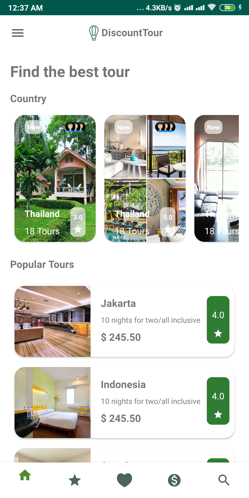

# PADC-X-RX-TRAVEL-APP-APS
 with RX 
 
 --> Network Request ကရလာတဲ့ observalbe datasource 2 ခု ကို VO တစ်ခုနေနဲ့ပေါင်း ပြီး  view မှာ ပြန် bind ထားတဲ့ ပံု စံ ဖြစ်ပါတယ်
 
 --> Network Request ကိုပေါင်း ရာတွင် RX ရဲ့ zip operator ကိုအသ့းပြုထားပါတယ် (TourModelImpl ထဲမှာ ရှိပါတယ် )
 
 --> Nested Recycler ကိုလည်း ပြန်လည် setup လုပ်ထားပါတယ်
 
 --> Detail အတွက် data ကို  room နဲ့ setup လုပ်ထားပါတယ်
 
 --> Network ကရတဲ့ dataတွေက Observable ုံစံဖြစ်ပြီး ,Room ထဲက dataတွေကို  LiveData နဲ့  setup လုပ်ထားပါတယ်
 
 

